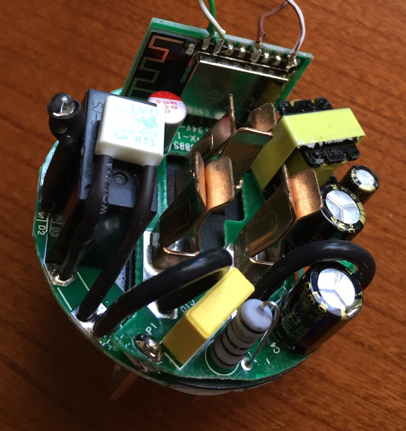
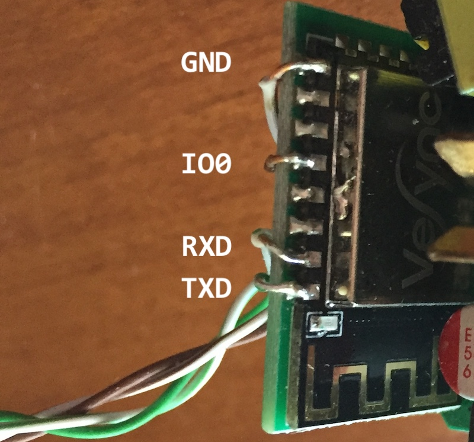

# Internals

Etekcity's outlet is internally comprised of three PCBs:

1. AC + Relay
2. AC/DC + HLW8012
3. Micro controller (ESP8266/ESP12E)

With the Micro controller's EMI shield being branded as "VeSync".



## Connections

The micro controller board slots into the other two boards making eight points of conductivity:

1. Relay (also lights LED yellow)
2. HLW8012 CF pin (pulse for active power)
3. Blue LED
4. HLW8012 CF1 pin (voltage/current 50% duty cycle)
5. SW1 button
6. Not connected
7. GND
8. 5V

Pin 1 is arbitrarily the left most pin when the EMI shield is facing away from you.


## Getting inside

Note: *You should not have to open the outlet to load custom firmware. However, if you want to load your own firmware, backup existing firmware, recover a bad firmware, or just have fun. You'll need to get inside the case.*

Good news is that there are no screws when pulling the outlet apart. Bad news is that there are no screws. Instead the housing is held together by seven plastic clips, along with a few select locations being welded together. Carefully run a knife around the joint, attacking any obvious welds. Then use a spudger tool to force the clips to disengage. These clips are pretty tough, so may require a couple of tools to get enough leverage to open the case.

Please be careful!


## Making contact

Wonderful thing about hacking an ESP8266 is that all of the development can occur over a serial connection. Well, a serial connection and some way of putting the device into programming mode.

For this you'll need a TTL 3V3 friendly 115200 serial interface. I've been using a [USB to TTL cable from Adafruit](https://www.adafruit.com/product/954).

We'll need to establish four wired connections to the ESP8266: TX, RX, GPIO0, and GND.

With the housing removed we have easy access to the "top" row of pins of the housing for the ESP8266. Which is super, as all of the needed pins are on this "top" row!

| ESP12E pinout               | ESW01-USA                                |
| --------------------------- | ---------------------------------------- |
|  |  |

Once these connections are in place the ESP8266 can be put into programming mode by temporarily grounding GPIO0 while booting the device.

Typically I prefer to wire connections to a pin header which can be inserted into a bread board. This allows for connections to be made/changed on the bread board without having to re-solder wires.

If you're crazy enough to power this up off of mains voltage without the cover. PLEASE BE CAREFUL. We've essentially exposed mains voltage wires here. Please treat it as such.

Serial settings are 115200 8N1.

When booting normally (with the factory firmware) you should see something like:

```
2.0.0(5a875ba)
wswitch system init ...
Device name:vesync_wifi_outlet
Device version:1.5
Device version code:5
--
Firm name:cosytek_firm_a
Firm version:1.89
Firm version code:89
Flash-Size-Map: FLASH_SIZE_32M_MAP_512_512
...
```


## Backing up

Place the device into programming mode by temporarily grounding GPIO0 during boot.

* [esptool.py](https://github.com/espressif/esptool) - ESP8266 and ESP32 serial bootloader utility

Use the esptool Python script to dump the flash to a local file:

```
./esptool.py --port /dev/tty.usbserial read_flash 0 0x400000 etekcity.bin
```

Here's the procedure to restore from a dumped image:

```
./esptool.py --port /dev/tty.usbserial write_flash 0x00000 etekcity.bin
```


## Taking over

With full programming access to the ESP8266 it is now trivial to load our own firmware. Place the device into programming mode by temporarily grounding GPIO0 during boot. Program the chip using your preferred environment.

Recommend investigating the various OTA (Over The Air) upgrade solutions as playing with GPIO0 does get old fast.

* [ESP8266 Arduino OTA](http://esp8266.github.io/Arduino/versions/2.0.0/doc/ota_updates/ota_updates.html)

